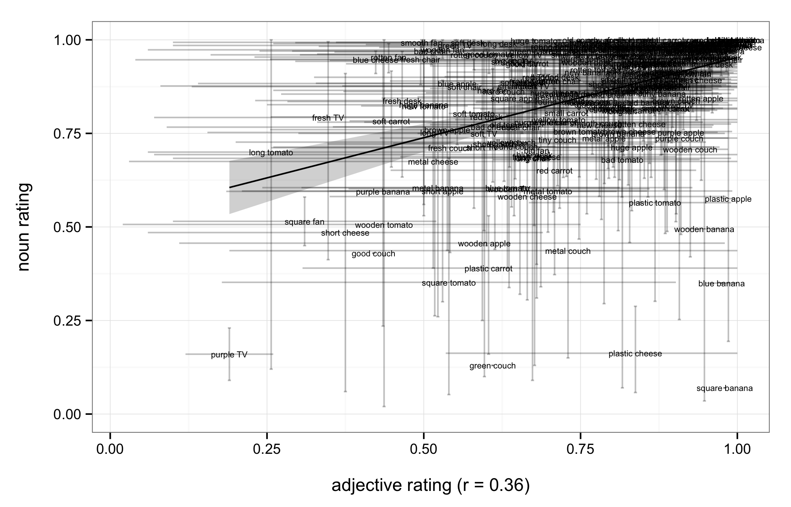
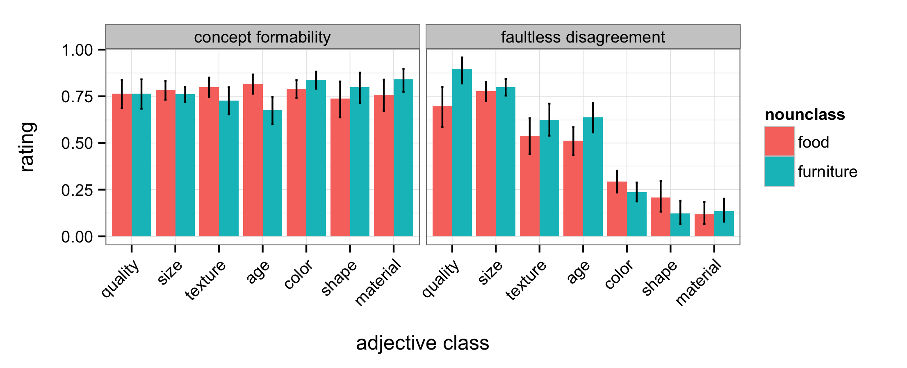
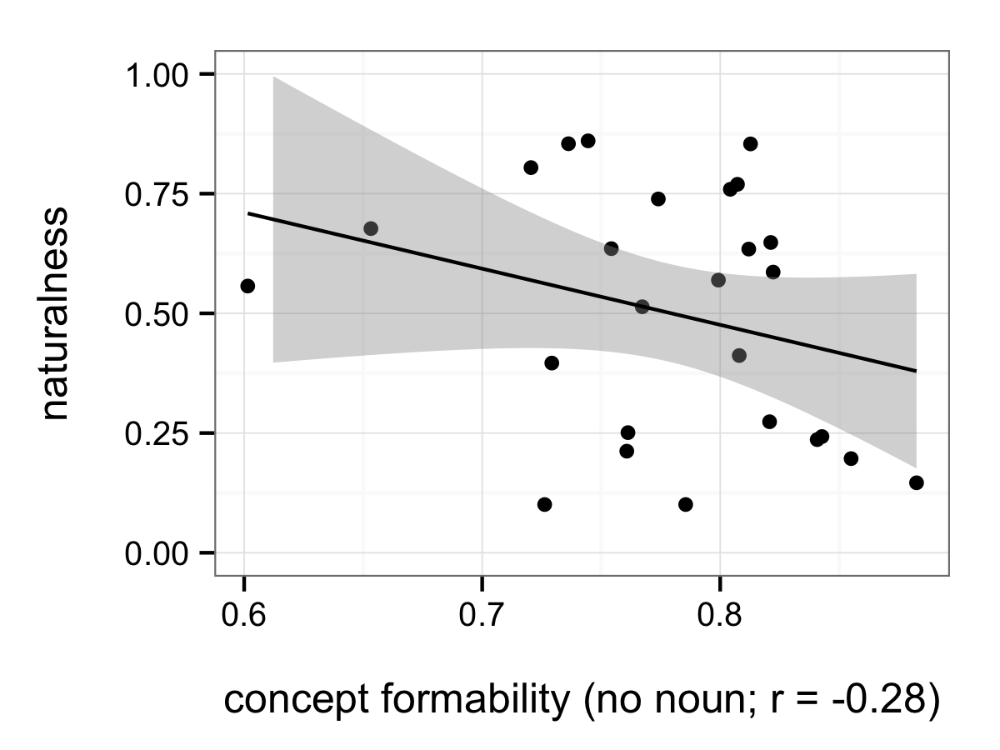
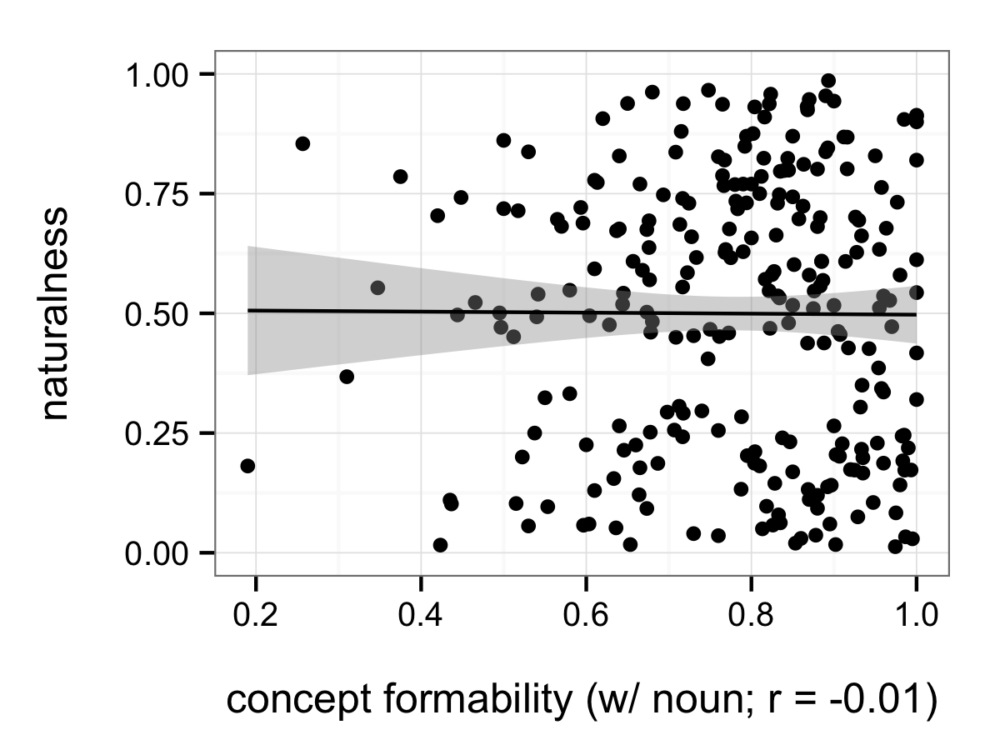

## Looking for effects of noun

[the concept-formability experiment](http://web.stanford.edu/~scontras/adjective_ordering/experiments/9-concept-formability/concept-formability.html)

#### comparing adjective and noun concept formability ratings

#### concept formability and faultless disagreement

#### order preference (naturalness) and concept formability
At the level of adjective classes:

At the level of adjective-noun configurations:
