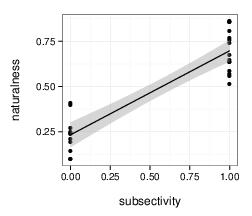
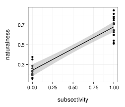
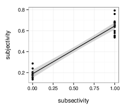
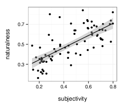
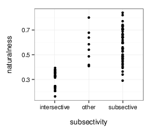
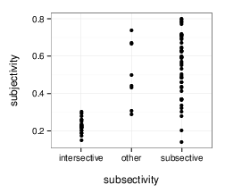

### Subsective vs. Intersective analysis

[Truswell (2009)](http://www.mitpressjournals.org/doi/abs/10.1162/ling.2009.40.3.525): **intersective** adjectives occur closer to nouns than **subsective** adjectives; **modal** adjectives have free order.

-  *Intersective*: [[Adj N]] = [[Adj]] ∩ [[N]]
- *Subsective*: [[Adj N]] ⊆ [[N]]
- *Non-subsective*: [[Adj N]] ⊈ [[Adj]] & [[Adj N]] ⊈ [[N]]

#### Experiment 1: Origninal 26 adjectives and 10 nouns

Fig. 1: Adjective subjectivity vs. adjective naturalness (i.e., preferred distance from noun); r^2 = 0.81.

Fig. 2: Adjective subsectivity vs. adjective naturalness; r^2 = 0.82.

Fig. 3: Adjective subsectivity vs. adjective subjectivity; r^2 = 0.89.

#### Experiment 2: Original 26 adjectives and 5 new nouns

Fig. 4: Adjective subjectivity vs. adjective naturalness; r^2 = 0.85.

Fig. 5: Adjective subsectivity vs. adjective naturalness; r^2 = 0.85.

Fig. 6: Adjective subsectivity vs. adjective subjectivity; r^2 = 0.93.

#### Experiment 3: 78 new adjectives and 166 new nouns

Fig. 7: Adjective subjectivity vs. adjective naturalness; r^2 = 0.51.

Fig. 8: Adjective subsectivity vs. adjective naturalness; r^2 = 0.56.

Fig. 9: Adjective subsectivity vs. adjective subjectivity; r^2 = 0.52.